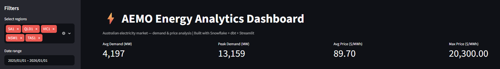
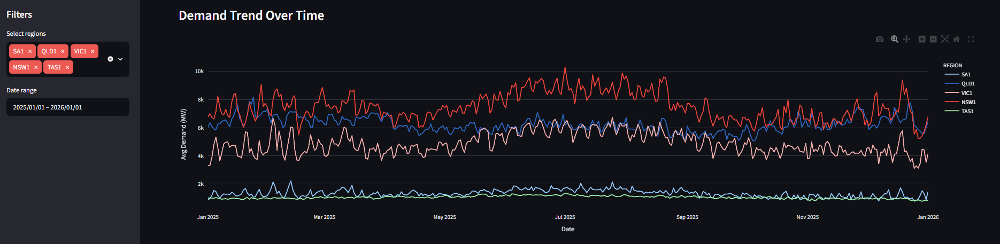
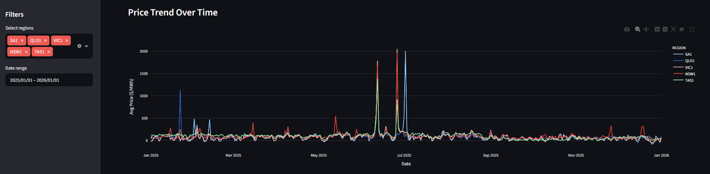
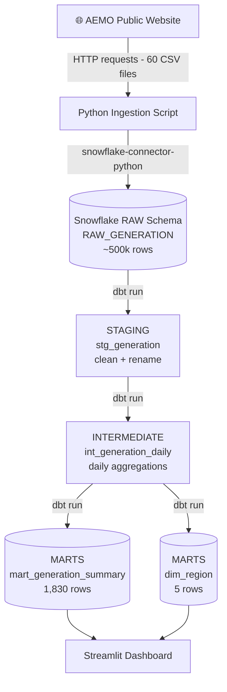
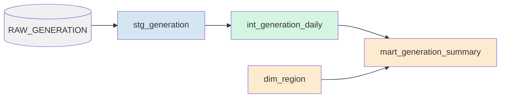

# ⚡ AEMO Energy Analytics Platform

An end-to-end data engineering project built on **Snowflake**, **dbt**, and **Python** —
ingesting Australian electricity market data and transforming it into analytics-ready models,
visualised in an interactive Streamlit dashboard.

---

## Dashboard Preview





---

## Architecture


---

## Tech Stack

| Layer | Tool |
|---|---|
| Data Warehouse | Snowflake |
| Transformation | dbt |
| Ingestion | Python, pandas |
| Visualisation | Streamlit, Plotly |
| Source Data | AEMO NEM — Price & Demand |

---

## Dataset

Public electricity market data from the **Australian Energy Market Operator (AEMO)**,
covering all 5 NEM regions (NSW, VIC, QLD, SA, TAS) across 2025 — ~500k rows of
5-minute interval settlement data.

| Column | Description |
|---|---|
| REGION | NEM region code |
| SETTLEMENTDATE | 5-minute settlement interval timestamp |
| TOTALDEMAND | Total electricity demand in MW |
| RRP | Regional reference price in AUD/MWh |
| PERIODTYPE | Settlement period type |

> Note: Western Australia operates a separate grid (SWIS/WEM) and is not part of the NEM dataset.

---

## dbt Data Model


- **11 dbt tests** across all layers (not_null, unique, accepted_values, relationships)
- Star schema design with fact and dimension tables

---

## Key Insights

- **NSW consistently has the highest electricity demand** across all NEM regions
- **South Australia shows the most price volatility** — driven by high renewable penetration
- **Peak demand occurs on weekdays** across all regions, dropping significantly on weekends
- **7-day rolling averages** reveal clear seasonal demand patterns across 2024

---

## Getting Started

**1. Clone the repo**
```bash
git clone https://github.com/your-username/aemo-energy-analytics.git
cd aemo-energy-analytics
```

**2. Install dependencies**
```bash
pip install -r requirements.txt
```

**3. Set up credentials**

Create a `.env` file in the root folder and fill in your Snowflake credentials:
```bash
# Windows
copy .env.example .env

# Mac/Linux
cp .env.example .env
```

Then open `.env` and fill in your values:
```
SNOWFLAKE_ACCOUNT=your-account-identifier
SNOWFLAKE_USER=your-username
SNOWFLAKE_PASSWORD=your-password
SNOWFLAKE_WAREHOUSE=ANALYTICS_WH
SNOWFLAKE_DATABASE=ENERGY_DB
SNOWFLAKE_SCHEMA=RAW
```

**4. Run ingestion**
```bash
python ingestion/load_aemo.py
```

**5. Run dbt**
```bash
cd aemo_analytics
dbt run
dbt test
```

**6. Launch dashboard**
```bash
cd ..
streamlit run dashboard/app.py
```
